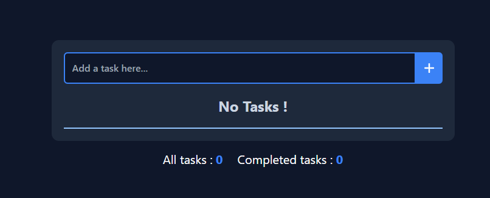
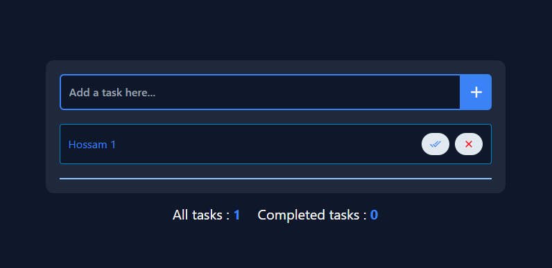
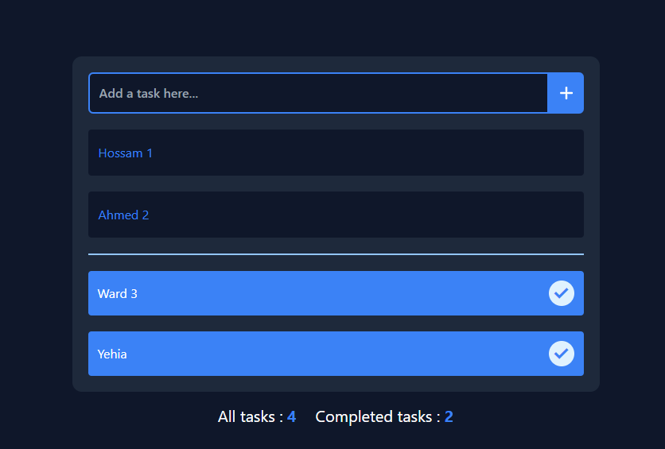

# Simple to-do list using React with Tailwind

## Features

1. Display a list of to-do items.

2. Allow users to add new to-do items.

3. Allow users to mark to-do items as completed.

4. display a count of total to-do items and completed to-do items.

5. Mark to-do items as complete.

6. Using React Testing for test the three components (AddTask - TaskButton - TaskItem).

# Screenshots

## Initial screen

## Adding a new todo

## Add task to completed tasks

